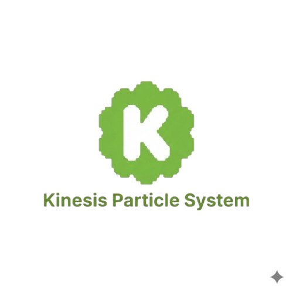

# ✨ Kinesis Particle System

 

<p align="center">
    
</p>

> **A C++ particle system editor with real-time controls via ImGui, built on Raylib. Create, tweak, and export beautiful particle effects with ease.**

---

## 🎯 Overview

This project is a **2D particle system editor** written in C++ with real-time editing capabilities using **ImGui**. It is designed to help developers, artists, and designers quickly prototype and export particle effects with multiple emitter types and customizable properties.

---

## ✨ Features

✅ Real-time editing with ImGui:

* Adjust properties instantly
* See changes immediately

✅ Customizable particle properties:

* Colors
* Sizes
* Lifetimes

✅ Configuration export:

* Save and reuse your effects

✅ Clean, modular C++ design

---

## 📸 Screenshot


---

## 🚀 Installation

1️⃣ Clone this repository:

```bash
git clone https://github.com/Dhaval572/2D-Particle_system.git
```

2️⃣ Install dependencies:

* [CMake](https://cmake.org/)
* [Raylib](https://www.raylib.com/)
* [ImGui](https://github.com/ocornut/imgui)
* [rlImGui](https://github.com/raylib-extras/rlImGui)

3️⃣ Build the project:

```bash
mkdir build
cd build
cmake ..
cmake --build .
```

---

## 📦 API Example

The following example demonstrates how to use **one exported particle effect** at runtime.

> **Important:** In this particle system, the **name comes from the exporter**. Whatever name you give to the effect during export is the name you use in code. This is a feature of the particle system editor.

In this README, `Bubble` is **only an example name**. If you exported an effect named `Fire`, `Smoke`, or `Spark`, you would replace `Bubble` with that exported name everywhere.

```cpp
#include <raylib.h>
#include "Bubble.h"

int main()
{
    InitWindow(600, 500, "Bubble Example");

    Bubble bubble;                 // Name matches the exported particle effect
    bubble.position = {300, 250};

    bubble.b_LoadTexture("assets/Bubble.png");
    bubble.SetUseTexture(false);

    SetTargetFPS(60);

    while (!WindowShouldClose())
    {
        float dt = GetFrameTime();
        bubble.Update(dt);

        BeginDrawing();
        ClearBackground(BLACK);

        bubble.Draw();

        EndDrawing();
    }

    CloseWindow();
    return 0;
}
```

---

## 🧩 Bubble API Reference

### `b_LoadTexture(const char* path)`

Loads a texture from disk and assigns it to the bubble. If loading fails, ensure the path is correct and the asset is included in your build/package.

```cpp
bubble.b_LoadTexture("assets/Bubble.png");
```

---

### `SetUseTexture(bool value)`

Enables or disables texture-based rendering.

* `true` → Renders the bubble using the loaded texture
* `false` → Renders the bubble using basic shapes (circle)

```cpp
bubble.SetUseTexture(false);
```

> **Default value:** `true`

---

### `bool b_IsUsingTexture() const`

Returns whether the bubble is currently using a texture for rendering.

#### Example:

```cpp
if (bubble.b_IsUsingTexture())
{
    // Texture-based rendering is enabled
}
else
{
    // Primitive-based rendering is enabled
}
```

**Returns:**

* `true` → Texture rendering is active
* `false` → Primitive rendering is active

---

### `Update(float deltaTime)`

Updates bubble behavior such as movement, lifetime, or animations.

```cpp
bubble.Update(dt);
```

---

### `Draw()`

Renders the bubble using either the texture or primitive rendering method.

```cpp
bubble.Draw();
```

---

## 💡 Notes

* The `Bubble` example is illustrative only — replace the class/header names to match your own types.
* Keep header filenames and class names consistent to avoid confusion and make your API easy to use.
* If you export a class from a header, prefer the convention: `HeaderName.h` contains `class HeaderName { ... };`.

---

## 🤝 Contributing

Contributions are **welcome and encouraged**!

Please:

1. Follow standard C++ style guidelines. [View Guidelines](https://github.com/Dhaval572/2D-Particle_system/blob/main/Project_guidelines.md)
2. Open issues for bugs/ideas.
3. Fork and submit pull requests for improvements.

---

## ❤️ Acknowledgments

* [Raylib](https://www.raylib.com/) – for making game development in C++ fun and easy.
* [ImGui](https://github.com/ocornut/imgui) – for the excellent immediate-mode UI.
* [rlImGui](https://github.com/raylib-extras/rlImGui) – for seamless integration with Raylib.

---

## 🌟 Star this repository!

If you find this project useful, please consider ⭐️ starring it on GitHub to help others discover it.
