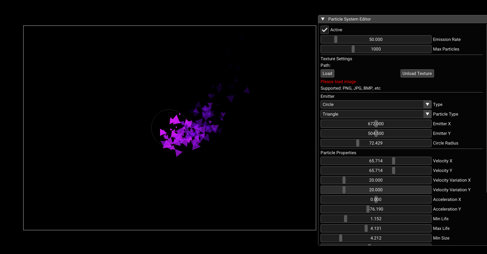

# ✨ 2D Particle System

 

> **A C++ particle system editor with real-time controls via ImGui, built on Raylib. Create, tweak, and export beautiful particle effects with ease.**

---

## 🎯 Overview

This project is a **2D particle system editor** written in C++ with real-time editing capabilities using **ImGui**. It is designed to help developers, artists, and designers quickly prototype and export particle effects with multiple emitter types and customizable properties.

---

## ✨ Features

✅ Real-time editing with ImGui:

* Adjust properties instantly
* See changes immediately

✅ Customizable particle properties:

* Colors
* Sizes
* Lifetimes

✅ Configuration export:

* Save and reuse your effects

✅ Clean, modular C++ design

---

## 📸 Screenshot





---

## 🚀 Installation

1️⃣ Clone this repository:

```bash
git clone https://github.com/yourusername/2DParticleSystem.git
```

2️⃣ Install dependencies:

* [CMake](https://cmake.org/)
* [Raylib](https://www.raylib.com/)
* [ImGui](https://github.com/ocornut/imgui)
* [rlImGui](https://github.com/raylib-extras/rlImGui)

3️⃣ Build the project:

```bash
mkdir build
cd build
cmake ..
cmake --build .
```

---

## 🛠️ Usage

After building:

```bash
./2DParticleSystem
```

Use the **ImGui** interface to:

* 📌 Create and modify particle systems
* 💾 Export configurations for reuse
* 📂 Import saved configurations

---

## 🤝 Contributing

Contributions are **welcome and encouraged**!

Please:

1. Follow standard C++ style guidelines. [View Guidelines](https://github.com/Dhaval572/2D-Particle_system/blob/main/Project_guidelines.md)

2. Open issues for bugs/ideas.
3. Fork and submit pull requests for improvements.

---

## ❤️ Acknowledgments

* [Raylib](https://www.raylib.com/) – for making game development in C++ fun and easy.
* [ImGui](https://github.com/ocornut/imgui) – for the excellent immediate-mode UI.
* [rlImGui](https://github.com/raylib-extras/rlImGui) – for seamless integration with Raylib.

---

## 🌟 Star this repository!

If you find this project useful, please consider ⭐️ starring it on GitHub to help others discover it.

---
